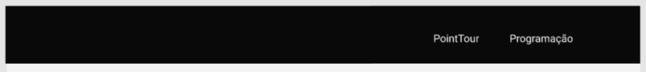
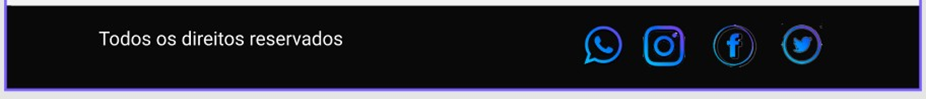
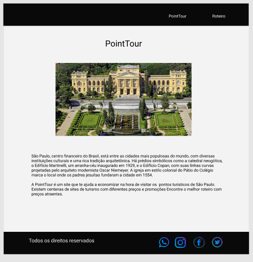
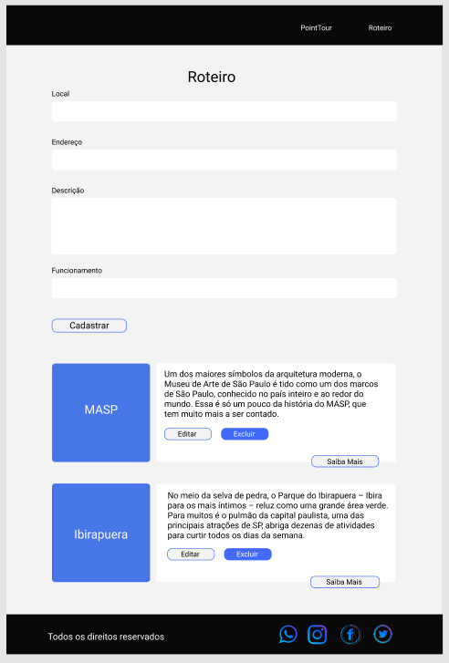
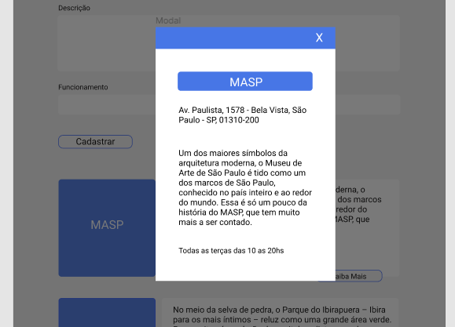
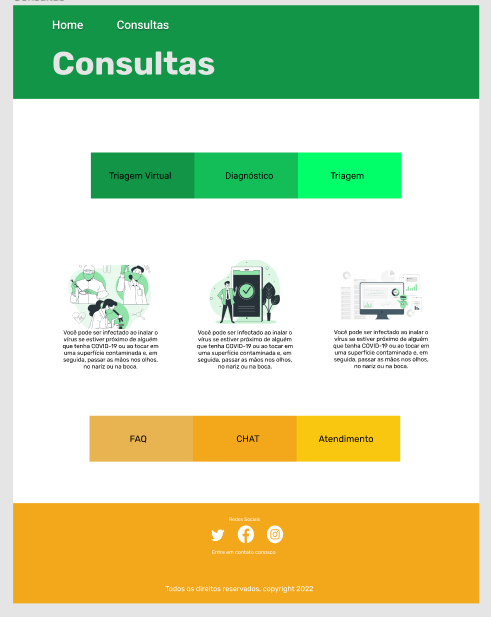
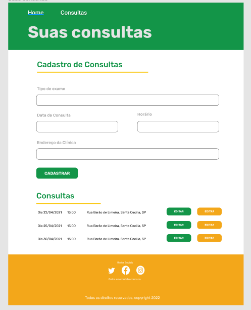

# Exercícios: Componentização III

**1 -** Crie um projeto React.js com javascript (jsx), com o nome ‘pointtour'. Exclua os arquivos
que não serão utilizados e cria as pastas assets, pages e components (com as pastas css).

**2 -** No projeto 'pointtour' crie os componentes header e footer, conforme estilizaçao do
arquivo figma:
[https://www.figma.com/file/ZKhzqBtbldoycdQ6sJCs0q/ExrcicioSprint6?node-id=0%3A1](https://www.figma.com/file/ZKhzqBtbldoycdQ6sJCs0q/ExrcicioSprint6?node-id=0%3A1)

**HEADER**

**FOOTER**

**3 -** No projeto ‘pointtour' crie a página PointTour conforme estilização do arquivo figma.
Utilize framework de front-end:
[https://www.figma.com/file/ZKhzqBtbldoycdQ6sJCs0q/ExrcicioSprint6?node-id=0%3A1](https://www.figma.com/file/ZKhzqBtbldoycdQ6sJCs0q/ExrcicioSprint6?node-id=0%3A1)

**4 -** No projeto ‘pointtour' crie a página Roteiro conforme estilização do arquivo figma. Utilize
framework de front-end::
[https://www.figma.com/file/ZKhzqBtbldoycdQ6sJCs0q/ExrcicioSprint6?node-id=0%3A1](https://www.figma.com/file/ZKhzqBtbldoycdQ6sJCs0q/ExrcicioSprint6?node-id=0%3A1)

**5 – OPCIONAL:** No projeto ‘pointtour' crie com a ajuda de uma framework front-end, um
modal conforme estilização do arquivo figma.
[https://www.figma.com/file/ZKhzqBtbldoycdQ6sJCs0q/ExrcicioSprint6?node-id=0%3A1](https://www.figma.com/file/ZKhzqBtbldoycdQ6sJCs0q/ExrcicioSprint6?node-id=0%3A1)

**6 -** Crie um projeto React.js com javascript (jsx), com o nome ‘consultas’. Exclua os arquivos
que não serão utilizados e cria as pastas assets, pages e components (com as pastas css).

**7 -** No projeto ‘consultas’ crie os componentes header e footer, conforme estilização do
arquivo figma: [https://www.figma.com/file/ZKhzqBtbldoycdQ6sJCs0q/ExrcicioSprint6?nodeid=0%3A1](https://www.figma.com/file/ZKhzqBtbldoycdQ6sJCs0q/ExrcicioSprint6?nodeid=0%3A1)

**HEADER**

**FOOTER**

**8 -** No projeto ‘consultas’ crie a página Home conforme estilização do arquivo figma.
Utilize framework de front-end:

**9 -** No projeto ‘consultas’ crie a página Consultas conforme estilização do arquivo figma.
Utilize framework de front-end:

