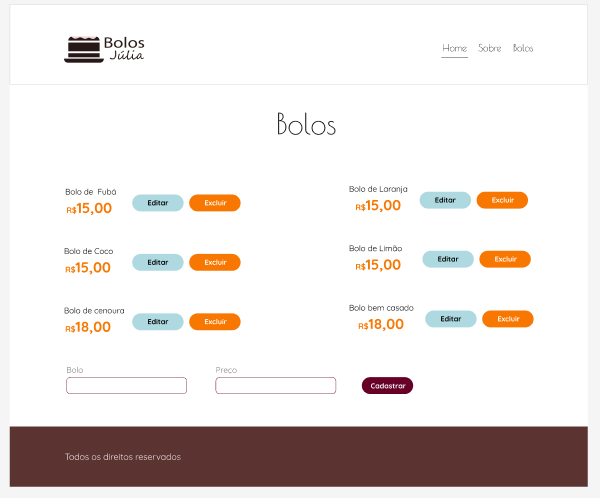
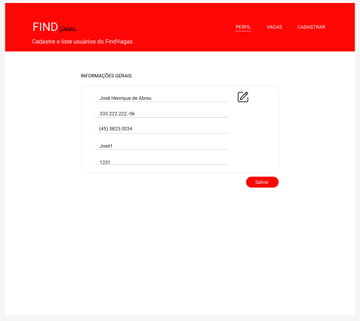
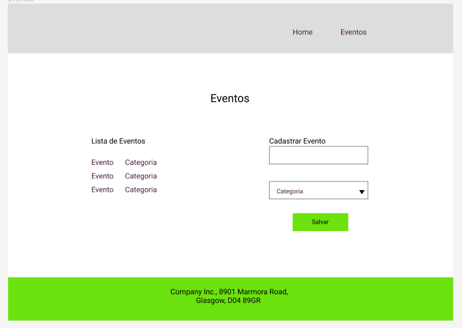
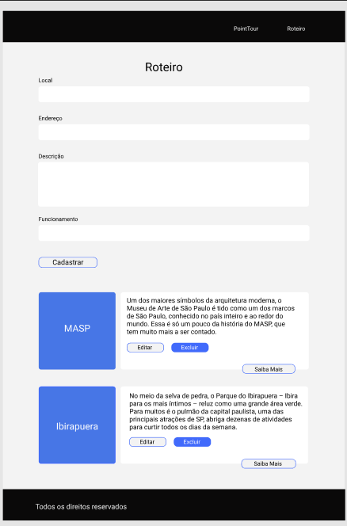
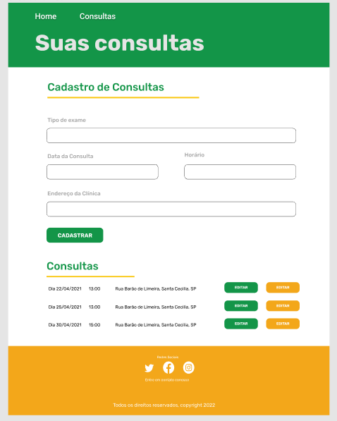

# Exercícios: Implementação do CRUD

**1 -** No projeto 'bolosjulia', da sprint anterior (Sprint 5), na página bolos implemente as
funcionalidades: Cadastrar bolo, Listar Bolo, Editar Bolo e Excluir Bolo; consumindo a
API criada na lista de Mock API desta Sprint 6, exercício 1.
Referência da interface:
[https://www.figma.com/file/pZXlah3MvitCpY6G2RKMhB/Exercícios-FrontEnd?node-id=0%3A1](https://www.figma.com/file/pZXlah3MvitCpY6G2RKMhB/Exerc%C3%ADcios-FrontEnd?node-id=0%3A1)

**2 -** No projeto 'vagas' da sprint anterior (Sprint 5), na página perfil implemente as
funcionalidades: Cadastrar usuário, Listar usuário, Editar usuário e Excluir usuário;
consumindo a API criada na lista de Mock API desta Sprint 6, exercício 2.
Referência da interface:
[https://www.figma.com/file/pZXlah3MvitCpY6G2RKMhB/Exercícios-FrontEnd?node-id=0%3A](https://www.figma.com/file/pZXlah3MvitCpY6G2RKMhB/Exerc%C3%ADcios-FrontEnd?node-id=0%3A1)

**3 -** No projeto ‘eventos’ da sprint anterior (Sprint 5), na página eventos implemente as
funcionalidades: Cadastrar evento, Listar evento, Editar evento e Excluir evento;
Consumindo a API criada na lista de Mock API desta Sprint 6, exercício 3.
Referência da interface:
[https://www.figma.com/file/pZXlah3MvitCpY6G2RKMhB/Exercícios-FrontEnd?node-id=0%3A1](https://www.figma.com/file/pZXlah3MvitCpY6G2RKMhB/Exerc%C3%ADcios-FrontEnd?node-id=0%3A1)

**4 -** No projeto ‘pointtour’, na página roteiro implemente as funcionalidades: Cadastrar
roteiro, Listar roteiro, Editar roteiro e Excluir roteiro; consumindo a API criada na lista de
Mock API desta Sprint 6, exercício 4.
Referência da interface:
[https://www.figma.com/file/ZKhzqBtbldoycdQ6sJCs0q/ExrcicioSprint6?node-id=0%3A1](https://www.figma.com/file/ZKhzqBtbldoycdQ6sJCs0q/ExrcicioSprint6?node-id=0%3A1)

**5 -** No projeto ‘consultas’, na página Consultas, implemente as funcionalidades: Cadastrar
roteiro, Listar consulta, Editar consulta e Excluir consulta; consumindo a API criada na
lista de Mock API desta Sprint 6, exercício 5.
Referência da interface:
[https://www.figma.com/file/ZKhzqBtbldoycdQ6sJCs0q/ExrcicioSprint6?node-id=0%3A1](https://www.figma.com/file/ZKhzqBtbldoycdQ6sJCs0q/ExrcicioSprint6?node-id=0%3A1)

